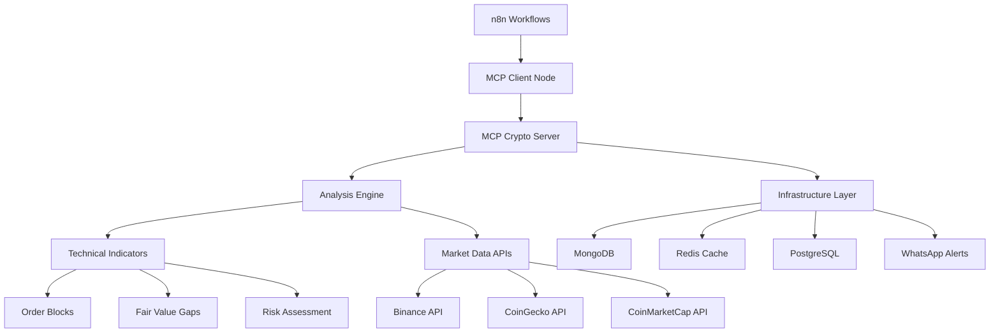

# MCP Crypto Trading Analysis

```
┌─────────────────────────────────────────────────────────────────┐
│  $$\      $$\  $$$$$$\  $$$$$$$\         $$$$$$\  $$$$$$$\       │
│  $$$\    $$$ |$$  __$$\ $$  __$$\       $$  __$$\ $$  __$$\      │
│  $$$$\  $$$$ |$$ /  \__|$$ |  $$ |      $$ /  \__|$$ |  $$ |     │
│  $$\$$\$$ $$ |$$ |      $$$$$$$  |      $$ |      $$$$$$$  |     │
│  $$ \$$$  $$ |$$ |      $$  ____/       $$ |      $$  __$$<      │
│  $$ |\$  /$$ |$$ |  $$\ $$ |            $$ |  $$\ $$ |  $$ |     │
│  $$ | \_/ $$ |\$$$$$$  |$$ |            \$$$$$$  |$$ |  $$ |     │
│  \__|     \__| \______/ \__|             \______/ \__|  \__|     │
│                                                                 │
│        Professional Cryptocurrency Trading Analysis             │
│            Institutional-Grade MCP Integration                  │
└─────────────────────────────────────────────────────────────────┘
```

**Advanced cryptocurrency trading analysis platform with institutional-grade indicators, real-time portfolio monitoring, and seamless n8n workflow integration for professional trading operations.**

## What This System Does

Transform raw cryptocurrency market data into actionable trading intelligence through:

- **Smart Market Analysis** - Detect Order Blocks, Fair Value Gaps, and Break of Structure patterns used by institutional traders
- **Real-Time Monitoring** - Track portfolio performance with intelligent risk assessment and automated alerting
- **Workflow Automation** - Native n8n MCP integration for seamless trading workflow automation
- **Production Infrastructure** - Enterprise-ready deployment with Kaayaan infrastructure integration

## Architecture Overview



## Core Trading Tools (7 Intelligent MCP Tools)

### 1. Advanced Crypto Analysis
**`analyze_crypto`** - Institutional-grade market analysis
- Order Blocks detection with strength scoring
- Fair Value Gaps identification
- Break of Structure and Change of Character analysis
- Dynamic volatility classification
- Smart BUY/SELL/HOLD recommendations

### 2. Portfolio Monitoring
**`monitor_portfolio`** - Real-time portfolio health tracking
- Position-by-position risk assessment
- Dynamic stop-loss and take-profit suggestions
- Correlation analysis across holdings
- Performance attribution reporting

### 3. Opportunity Detection
**`detect_opportunities`** - AI-powered market scanning
- Multi-timeframe confluence analysis
- Cross-asset arbitrage opportunities
- Momentum breakout identification
- Risk-adjusted opportunity scoring

### 4. Risk Assessment
**`risk_assessment`** - Comprehensive risk management
- Value-at-Risk (VaR) calculations
- Maximum Drawdown analysis
- Position sizing recommendations
- Portfolio heat mapping

### 5. Market Scanner
**`market_scanner`** - Automated market surveillance
- Top gainers/losers identification
- Volume anomaly detection
- Technical pattern screening
- Sector rotation analysis

### 6. Alert Manager
**`alert_manager`** - Intelligent notification system
- Price threshold monitoring
- Technical indicator alerts
- Portfolio milestone notifications
- WhatsApp integration for instant alerts

### 7. Historical Backtesting
**`historical_backtest`** - Strategy validation engine
- Strategy performance analysis
- Risk metrics calculation
- Optimal parameter identification
- Monte Carlo simulations

## Quick Start

### Prerequisites
- Python 3.11+ 
- Docker & Docker Compose (for production deployment)
- API keys for cryptocurrency data sources

### Development Setup

```bash
# Clone the repository
git clone <your-repo-url> mcp-crypto-trading
cd mcp-crypto-trading

# Create and activate virtual environment
python3 -m venv venv
source venv/bin/activate  # Windows: venv\Scripts\activate

# Install dependencies
pip install -r requirements_mcp.txt

# Configure environment
cp .env.production.example .env.production
# Edit .env.production with your API keys

# Start MCP server
python mcp_server_standalone.py
```

### Production Deployment

```bash
# Quick Docker deployment
./scripts/start_mcp_server.sh docker

# Or manual deployment
docker-compose -f docker-compose.kaayaan.yml up -d

# Verify deployment
./scripts/validate_infrastructure.py
./scripts/validate_build.sh

# Monitor logs
docker logs kaayaan-crypto-trading
```

### n8n Integration

1. **Install MCP Client Node** in your n8n instance
2. **Configure MCP Server** connection:
   - Server URL: `stdio://path/to/mcp_crypto_server.py`
   - Protocol: `stdio`
3. **Use Trading Tools** in your workflows

## API Examples

### Basic Analysis
```json
{
  "tool": "analyze_crypto",
  "arguments": {
    "symbol": "BTCUSDT",
    "timeframe": "1h",
    "save_analysis": true
  }
}
```

**Response:**
```json
{
  "symbol": "BTCUSDT",
  "analysis": {
    "trend": "bullish_strong",
    "volatility": "moderate",
    "confidence": 87.3,
    "intelligent_score": 1.34
  },
  "order_blocks": [
    {
      "level": 43250.50,
      "type": "demand",
      "strength": 85.2,
      "timestamp": "2024-12-19T09:00:00Z"
    }
  ],
  "recommendation": {
    "action": "BUY",
    "confidence": 87.3,
    "reasoning": "Strong bullish trend with moderate volatility"
  }
}
```

### Portfolio Monitoring
```json
{
  "tool": "monitor_portfolio",
  "arguments": {
    "positions": [
      {"symbol": "BTCUSDT", "size": 1.5, "entry_price": 42000},
      {"symbol": "ETHUSDT", "size": 10, "entry_price": 2500}
    ]
  }
}
```

### Market Scanning
```json
{
  "tool": "market_scanner",
  "arguments": {
    "scan_type": "breakout_momentum",
    "min_volume": 1000000,
    "timeframes": ["15m", "1h", "4h"]
  }
}
```

## Configuration

| Setting | Environment Variable | Default | Purpose |
|---------|---------------------|---------|---------|
| Binance API Key | `BINANCE_API_KEY` | - | Real-time market data |
| Binance Secret | `BINANCE_SECRET_KEY` | - | API authentication |
| CoinGecko Key | `COINGECKO_API_KEY` | - | Market cap data |
| CoinMarketCap Key | `COINMARKETCAP_API_KEY` | - | Additional metrics |
| MongoDB URI | `MONGODB_URI` | kaayaan default | Data storage |
| Redis URI | `REDIS_URL` | kaayaan default | Caching layer |
| PostgreSQL URI | `DATABASE_URL` | kaayaan default | n8n database |
| WhatsApp Session | `WHATSAPP_SESSION` | your_session_id | Alert delivery |

## Production Infrastructure

### Kaayaan Integration
- **MongoDB**: Trade data and analysis storage
- **Redis**: High-performance caching and session management
- **PostgreSQL**: n8n workflow data and user management
- **WhatsApp API**: Real-time alert delivery system

### Monitoring & Health Checks
- **Health Endpoint**: `/health` - System status verification
- **Infrastructure Validation**: Automated connectivity testing
- **Performance Metrics**: Response time and throughput monitoring
- **Alert System**: Proactive issue notification

### Scaling & Performance
- **Async Architecture**: Non-blocking I/O for high throughput
- **Connection Pooling**: Optimized database connections
- **Caching Strategy**: Redis-based result caching
- **Load Balancing**: Multi-instance deployment support

## n8n Workflow Templates

### Basic Trading Signal Workflow
```json
{
  "nodes": [
    {
      "name": "Market Analysis",
      "type": "mcp-client",
      "parameters": {
        "tool": "analyze_crypto",
        "arguments": {
          "symbol": "{{ $json.symbol }}",
          "timeframe": "1h"
        }
      }
    },
    {
      "name": "Risk Check",
      "type": "mcp-client",
      "parameters": {
        "tool": "risk_assessment",
        "arguments": {
          "analysis": "{{ $json.analysis }}"
        }
      }
    },
    {
      "name": "Send Alert",
      "type": "mcp-client",
      "parameters": {
        "tool": "alert_manager",
        "arguments": {
          "message": "Trading signal: {{ $json.recommendation.action }}"
        }
      }
    }
  ]
}
```

### Portfolio Monitoring Workflow
```json
{
  "nodes": [
    {
      "name": "Monitor Portfolio",
      "type": "mcp-client",
      "parameters": {
        "tool": "monitor_portfolio",
        "arguments": {
          "positions": "{{ $json.positions }}"
        }
      }
    },
    {
      "name": "Risk Alert Check",
      "type": "if",
      "parameters": {
        "conditions": {
          "number": [
            {
              "value1": "{{ $json.risk_score }}",
              "operation": "larger",
              "value2": 0.7
            }
          ]
        }
      }
    }
  ]
}
```

## Troubleshooting

### Common Issues

**MCP Server Connection Failed**
```bash
# Check server status
python mcp_crypto_server.py --validate

# Verify environment
./validate_infrastructure.py

# Check logs
tail -f logs/mcp_crypto.log
```

**API Rate Limiting**
- Binance: 1200 requests/minute
- CoinGecko: 50 calls/minute (free), 500/minute (pro)
- CoinMarketCap: 333 calls/day (free)

**Memory Issues**
```bash
# Monitor resource usage
docker stats mcp-crypto-trading

# Adjust Docker memory limits
docker-compose up -d --memory=2g
```

**Database Connection Issues**
```bash
# Test MongoDB connection
python -c "from infrastructure.kaayaan_factory import *; KaayaanInfrastructureFactory().create_mongodb_client()"

# Test Redis connection
redis-cli -h redis -p 6379 ping
```

### Performance Optimization

**Caching Strategy**
- Enable Redis caching for analysis results
- Set appropriate cache TTL based on timeframes
- Use pipeline operations for bulk data

**API Optimization**
- Batch multiple symbol requests
- Use WebSocket connections for real-time data
- Implement exponential backoff for retries

**Database Optimization**
- Create indexes on frequently queried fields
- Use aggregation pipelines for complex queries
- Archive historical data regularly

## Development

### Adding New Indicators
1. Implement in `technical_indicators.py`
2. Update analysis engine in `crypto_analyzer.py`
3. Add to MCP tool schema
4. Update documentation

### Testing
```bash
# Run unit tests
python -m pytest tests/ -v

# Integration tests
python test_infrastructure.py

# Load testing
python -m pytest tests/load_test.py
```

### Contributing Guidelines
- Follow PEP 8 style guidelines
- Add comprehensive docstrings
- Include unit tests for new features
- Update documentation
- Test with real market data

## Security Considerations

- Store API keys in secure environment variables
- Use read-only API permissions where possible
- Implement request rate limiting
- Regular security audits of dependencies
- Network security for production deployments

## Support

**Documentation:**
- [Deployment Guide](DEPLOYMENT_GUIDE.md) - Complete production setup
- [API Reference](API_REFERENCE.md) - Detailed tool specifications
- [Architecture Guide](ARCHITECTURE.md) - Technical system design
- [n8n Integration](N8N_INTEGRATION.md) - Workflow automation guide

**Getting Help:**
1. Check the troubleshooting section above
2. Review the appropriate documentation guide
3. Test with the validation scripts
4. Open GitHub issue with detailed logs

---

**Production-Ready Trading Intelligence** | Built for professional traders and institutional investors

*Last Updated: December 2024 | Version: 1.0.0*